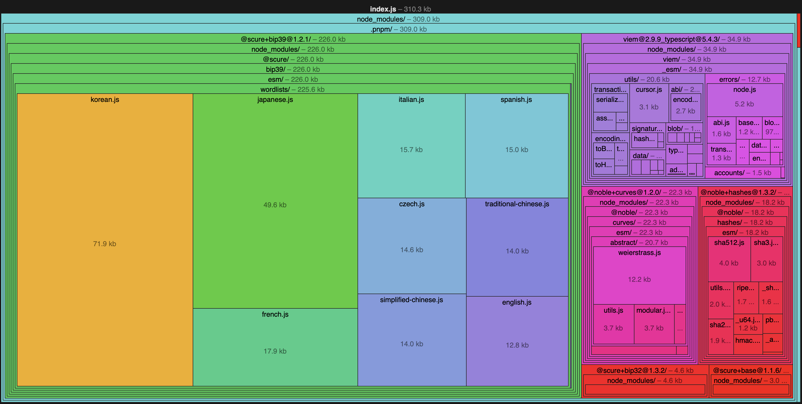

# viem-accounts-treeshaking

This is a simple demo of tree-shaking capabilities of viem when using [esbuild](https://esbuild.github.io) and the `viem/accounts` module.

```shell
pnpm i
pnpm run build
```

Load the file generated at `dist/meta.json` into [https://esbuild.github.io/analyze/](https://esbuild.github.io/analyze/).


